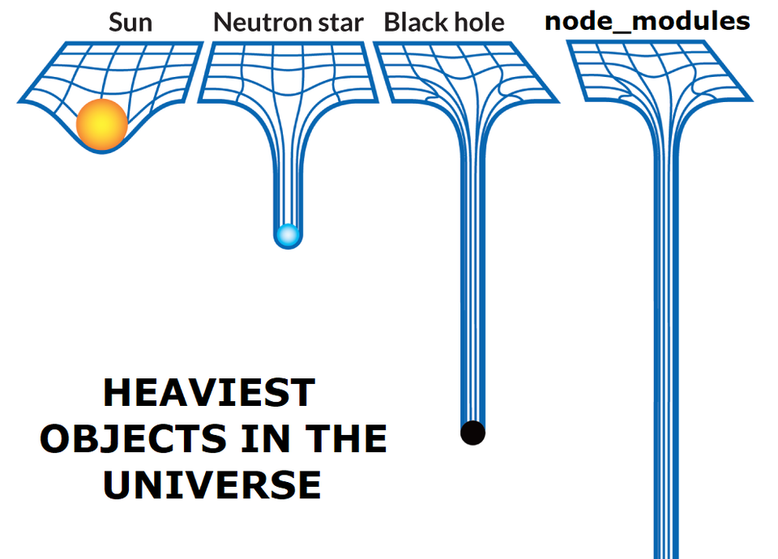

## node-modules-vision

Folder `node_modules` is most heavy object in the world *(laugh)*. We have technology to metirc blackhole's mass, so we also should have a way to check `node_modules`.

### Hightlight

- No need upload source code. just paste your lockfile, every thing we need is in here.
- Check your all dependencies and show with graph.
- Internationalization(Support English and Simplified Chinese)
